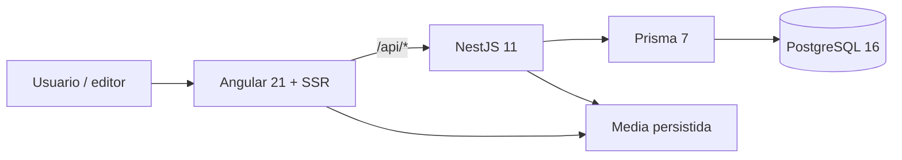
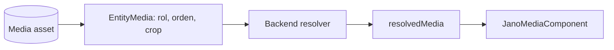
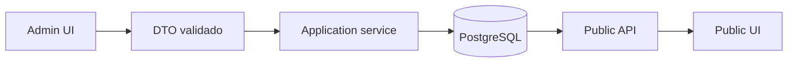

# JANO — Arquitectura vigente

Estado: **ACTIVE — visión técnica operativa**

Última revisión: 2026-06-30

Este documento describe la arquitectura que existe hoy. Las decisiones, límites y métricas del
refactor están en [`architectural-refactoring-audit.md`](./architectural-refactoring-audit.md).

Las decisiones normativas de Research Studio, sus límites de dominio y su experiencia editorial viven en [`docs/architecture/README.md`](./architecture/README.md). Este documento no es una segunda fuente de verdad para Research.

## 1. Principios

1. PostgreSQL y el backend son la fuente de verdad de negocio y contenido editorial persistido.
2. El frontend renderiza estado, interacción y previews; no reproduce resolución crítica del backend.
3. Cada loop, recurso imperativo o estado mutable tiene un único owner.
4. Controllers y componentes Angular son adapters; las reglas puras viven en presenters/helpers.
5. Se extrae una pieza por responsabilidad real, no para cumplir un número de líneas.
6. No se introducen stores globales, repositories genéricos ni interfaces de una implementación.

## 2. Contexto



| Área        | Tecnología                              | Ubicación                |
| ----------- | --------------------------------------- | ------------------------ |
| Frontend    | Angular standalone, SSR, RxJS, Three.js | `frontend/`              |
| Backend     | NestJS, Passport JWT, class-validator   | `backend/api/`           |
| Datos       | Prisma y PostgreSQL                     | `backend/api/prisma/`    |
| Infra local | Docker Compose + procesos host          | `infra/`, `package.json` |

## 3. Organización del repositorio

```text
backend/api/
  prisma/                 esquema, migraciones y seed
  src/
    entities/             catálogo, lectura, grafo y edición editorial
    media/                resolución, diagnóstico y lifecycle de media
    search/               intención, SQL y composición de resultados
    curated/              página curada, ranking y presentación
    home-decks/            CRUD editorial persistido
    collections/ saved/   espacio personal
    auth/ users/           sesión, JWT y roles

frontend/src/app/
  core/                   contratos HTTP, auth, SEO y servicios transversales
  features/               rutas y casos de uso
  shared/                 UI/media reutilizable sin reglas backend
```

Dirección permitida:

```text
route/component -> facade/runtime/presenter -> core API
controller -> application service -> Prisma
```

`core` no importa features. Un presenter puro no inyecta Angular/Nest ni accede a Prisma.

## 4. Backend

### 4.1 Módulos

`AppModule` compone: Prisma, Entities, Auth, Users, Saved, Collections, App Settings, Home Decks,
Search, Relation Types, Tags y Curated.

### 4.2 Entities

El antiguo servicio/controlador único fue sustituido por casos de uso explícitos:

| Pieza                                                  | Ownership                                                   |
| ------------------------------------------------------ | ----------------------------------------------------------- |
| `EntityReadController` / `EntityReadService`           | detalle público/admin, relaciones de lectura y preview      |
| `EntityCatalogService`                                 | listados, filtros y catálogos auxiliares                    |
| `EntityGraphController` / `EntityGraphService`         | grafo público y workspace admin                             |
| `EntityEditorialController` / `EntityEditorialService` | create/update/delete, traducciones y detalles               |
| `EntityTaxonomyService`                                | aliases, relaciones y tags                                  |
| `EntityCreditsService`                                 | fuentes y contributors                                      |
| `entity.presenter.ts`                                  | localización, typed details y serialización pura compartida |

La URL común `/entities` no implica un único servicio.

### 4.3 Media

Media es una capacidad transversal en `src/media/`:

- `media.resolver.ts`: resuelve slots canónicos y fallback permitido.
- `media-diagnostics.ts`: warnings/coverage para admin.
- `EntityMediaService`: comandos y consultas de links editoriales.
- `EntityMediaLifecycleService`: ingest, promote, restore y cleanup.
- `EntityMediaController`: superficie HTTP y configuración de upload compartida.

El público consume `resolvedMedia`; el frontend no reordena candidatos ni inventa slots.



### 4.4 Relaciones

`relationTypeId` es obligatorio y `RelationType.key` es la única identidad canónica. La columna
legacy `Relation.type` fue eliminada. El alias HTTP `type` se deriva de la clave canónica para
mantener compatibilidad con clientes existentes.

### 4.5 Search

```text
SearchController
  -> SearchService             intención, variantes, entidades y secciones
     -> SearchQueryRepository  SQL PostgreSQL y candidate rows
     -> SearchIntentService    interpretación determinista
```

El ranking SQL busca títulos, traducciones, aliases, tags, detalles y texto de relaciones. La
respuesta añade rutas de grafo y decks persistidos sin convertir el repositorio SQL en un framework.

### 4.6 Curated

- `CuratedService`: consultas y orquestación de la página.
- `curated-ranking.ts`: scoring, merge, orden y diversidad puros.
- `curated.presenter.ts`: respuesta localizada pura reutilizando `entity.presenter`.

### 4.7 Home Decks

Home y Curated leen exclusivamente `HomeDeck` persistidos. No existe fallback virtual ni endpoint de
materialización. `home-deck.presenter.ts` construye responses y `home-deck-warnings.ts` diagnostica
el estado admin.

## 5. Frontend

### 5.1 Rutas

Las rutas públicas principales son `/`, `/curated`, `/search`, `/entities/:type`, `/entity/:slug`,
`/my-space`, `/collections/:id`, `/profile` y `/settings`. El árbol `/admin` está protegido por
`adminGuard`; el resto de producto usa `authGuard` cuando corresponde.

### 5.2 Admin Entity Editor

`AdminEntityFormComponent` es la shell de ruta. Sus owners principales son:

- `AdminEntityFormFacade`: load/save/refresh y feedback.
- `AdminEntityRouteShell`: navegación, sección y contexto de ruta.
- componentes por tarea: global data, content, translations, relations, taxonomy, metadata, media y
  preview.
- presenters puros para payloads y metadata.

Los drafts recibidos por componentes son inmutables; los hijos emiten un valor nuevo.

### 5.3 Graph

- `GraphCameraRuntime`: viewport, focus y tooltip.
- `GraphInteractionRuntime`: pointer, pan, pinch, RAF y cleanup.
- módulos `graph-*.ts`: cálculos/coordinadores puros.
- `GraphComponent`: adapter Angular/DOM que conecta API, signals, runtimes y componentes visuales.

Solo las dos piezas con estado/lifecycle usan el sufijo `Runtime`.

### 5.4 Explorer 3D

`EntitiesExplorer3dComponent` posee interacción, navegación y accesibilidad.
`Explorer3dScene` posee Three.js, cards, raycast, resize, RAF y recursos GPU.
`explorer-3d-textures.ts` contiene canvas, wrapping y cálculo de recorte testeable.

### 5.5 App Chrome y búsqueda global

`AppChromeComponent` posee header, navegación y rail. `GlobalSearchComponent` posee query,
autocomplete, teclado, preparación editorial y las APIs de Search/Home Decks/Curated. Sus estilos no
viven en `styles.scss`.

### 5.6 Entity Detail

`EntityComponent` carga entidad, SEO y transición de ruta. `EntityDetailViewComponent` renderiza el
detalle. `EntitySavedCollectionsFacade`, scoped a la ruta, posee guardado, colecciones, feedback y
timers. `entity-detail.presenter.ts` concentra derivaciones puras.

### 5.7 Primer render

`index.html` contiene un estado de arranque nativo y accesible con la marca JANO. Se muestra antes
de que Angular termine el `APP_INITIALIZER` de i18n y Angular lo reemplaza al montar `App`. Así el
primer frame nunca queda reducido al fondo global y no se añade estado de aplicación duplicado.

## 6. Flujos de verdad

### Contenido editorial



La UI pública no crea contenido si la API devuelve vacío o error.

### Guardado y colecciones

El estado es local a `EntitySavedCollectionsFacade`; Saved/Collections API y PostgreSQL conservan la
verdad persistida. My Space vuelve a consultar esas APIs.

## 7. Reglas de cambio

- Regla de dominio: backend/application service o función pura de dominio.
- Mapping de respuesta: presenter puro.
- Estado coordinado de una ruta: facade scoped, solo cuando existe un subflujo real.
- WebGL/RAF/listeners: owner concreto con `destroy`/cleanup.
- Helper: sin DI, estado mutable ni I/O.
- Componentes visuales: inputs inmutables y outputs explícitos.
- El primer frame debe tener una UI mínima útil incluso antes del bootstrap de Angular.
- No añadir fallback público hardcoded, event bus, NgRx, CQRS o interfaces de una implementación sin
  evidencia nueva.

Los triggers de tamaño y la checklist de PR están en el audit arquitectónico.

## 8. Verificación

Gate local completo:

```bash
npm run check
```

Checks por workspace:

```bash
npm --prefix backend/api run typecheck
npm --prefix backend/api test -- --runInBand
npm --prefix backend/api run build
npm --prefix frontend run typecheck
npm --prefix frontend test -- --watch=false
npm --prefix frontend run build
```

El build de producción aplica `anyComponentStyle` como error a partir de 28 kB. No se sube el budget
para ocultar deuda: primero se eliminan estilos muertos o se transfiere ownership al componente que
los renderiza.

## 9. Excepciones conscientes

- `GraphComponent` supera el trigger general porque sigue siendo el adapter de una escena compleja;
  no debe convertirse en un mega-runtime de callbacks. Las nuevas reglas van a módulos puros o a los
  dos runtimes propietarios.
- `SearchService` supera 600 líneas porque compone la respuesta editorial. El SQL ya está aislado;
  solo se divide de nuevo si aparece otro caso de uso independiente.
- `isVirtual: false` permanece temporalmente en la respuesta de Home Decks por compatibilidad HTTP;
  no activa ningún fallback.

## 10. Documentación

- Este archivo: arquitectura vigente.
- `architectural-refactoring-audit.md`: decisiones, reglas, roadmap y progreso del refactor.
- `er-diagram.md`: detalle del modelo relacional.
- `environment.md`, `development-workflow.md`, `commands.md`: operación local.
- Los documentos con estado `IMPLEMENTED` o `SUPERSEDED` son históricos y no definen arquitectura.
