# JANO - Arquitectura del repositorio

Ultima revision: 2026-05-09

## Resumen ejecutivo

JANO es un monorepo full-stack para descubrimiento editorial de arte. La arquitectura actual esta dividida en:

- `frontend/`: aplicacion Angular standalone con SSR, rutas protegidas, experiencia publica, exploracion visual, colecciones y admin editorial.
- `backend/api/`: API NestJS con Prisma, autenticacion JWT, roles, beta access, resolucion de entidades, medios, grafo, busqueda, colecciones y home decks.
- `backend/api/prisma/`: modelo PostgreSQL y migraciones.
- `infra/`: Docker Compose para PostgreSQL, backend, frontend y Adminer.
- `docs/`: documentacion operativa y de producto.

La pieza central del dominio es `Entity`. Desde ahi se conectan relaciones semanticas, medios editoriales, fuentes, detalles tipados, tags, guardados, colecciones y decks editoriales.

## Stack

| Capa | Tecnologia | Ubicacion |
| --- | --- | --- |
| Frontend | Angular 21, Angular SSR, RxJS, Three.js | `frontend/` |
| Backend | NestJS 11, Passport JWT, class-validator | `backend/api/` |
| ORM | Prisma 7 | `backend/api/prisma/` |
| Base de datos | PostgreSQL 16 | `infra/docker-compose.yml` |
| Infra local | Docker Compose + modo hibrido host/Docker | `package.json`, `infra/docker-compose.yml` |

## Diagrama de contexto

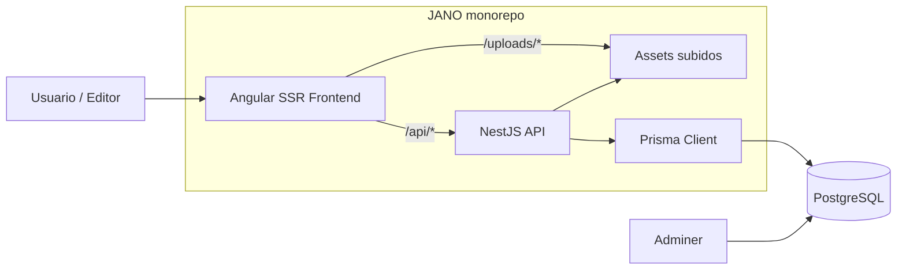

## Flujo principal de producto

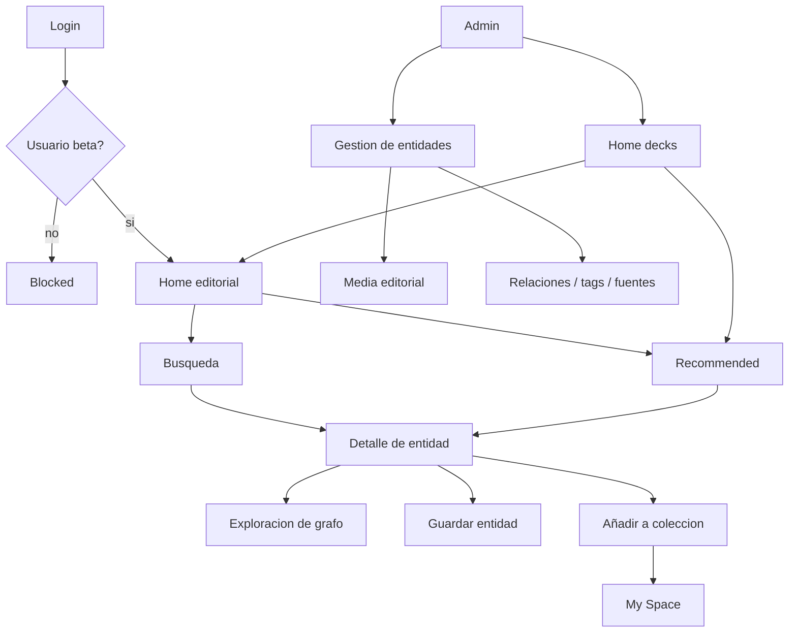

## Backend

### Modulos NestJS

`backend/api/src/app.module.ts` importa los modulos principales:

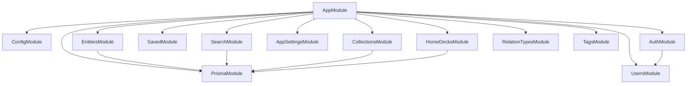

### Inventario de modulos backend

| Modulo | Responsabilidad | Archivos principales |
| --- | --- | --- |
| App bootstrap | Configura CORS, prefijo `/api`, static uploads y validation pipe | `src/main.ts`, `src/app.module.ts`, `src/app.controller.ts`, `src/app.service.ts` |
| Config | Validacion de entorno y salida de terminal | `src/config/env.validation.ts`, `src/config/terminal.ts` |
| Prisma | Cliente compartido de base de datos | `src/prisma/prisma.module.ts`, `src/prisma/prisma.service.ts` |
| Auth | Login, logout simbolico, sesion, JWT, roles y beta gate | `src/auth/auth.module.ts`, `src/auth/auth.controller.ts`, `src/auth/auth.service.ts`, `src/auth/strategies/jwt.strategy.ts`, `src/auth/guards/*.ts`, `src/auth/dto/*.ts` |
| Users | Resolucion de usuarios para auth/JWT | `src/users/users.module.ts`, `src/users/users.service.ts` |
| Entities | Catalogo editorial, detalle, admin CRUD, grafo, relaciones, fuentes, contributors, tags y media | `src/entities/entities.module.ts`, `src/entities/entities.controller.ts`, `src/entities/entities.service.ts`, `src/entities/media.resolver.ts`, `src/entities/image-metadata.ts`, `src/entities/dto/*.ts` |
| Search | Busqueda publica con filtros y resultados enriquecidos | `src/search/search.module.ts`, `src/search/search.controller.ts`, `src/search/search.service.ts`, `src/search/dto/search.query.ts`, `src/search/optional-jwt-auth.guard.ts` |
| Saved | Entidades guardadas por usuario | `src/saved/saved.module.ts`, `src/saved/saved.controller.ts`, `src/saved/saved.service.ts` |
| Collections | Colecciones personales, items ordenados y grafo de coleccion | `src/collections/collections.module.ts`, `src/collections/collections.controller.ts`, `src/collections/collections.service.ts`, `src/collections/dto/*.ts` |
| Home decks | Decks editoriales para `HOME` y `RECOMMENDED`, imagen y orden de entidades | `src/home-decks/home-decks.module.ts`, `src/home-decks/home-decks.controller.ts`, `src/home-decks/home-decks.service.ts`, `src/home-decks/dto/*.ts` |
| App settings | Ajustes publicos de aplicacion, especialmente fondo visual | `src/app-settings/app-settings.module.ts`, `src/app-settings/app-settings.controller.ts`, `src/app-settings/app-settings.service.ts` |
| Relation types | Catalogo de tipos de relacion | `src/relation-types/relation-types.module.ts`, `src/relation-types/relation-types.controller.ts`, `src/relation-types/relation-types.service.ts` |
| Tags | Taxonomia manual/editorial | `src/tags/tags.module.ts`, `src/tags/tags.controller.ts`, `src/tags/tags.service.ts`, `src/tags/dto/create-tag.dto.ts` |

### Endpoints principales

Todos cuelgan de `/api` por `app.setGlobalPrefix('api')`.

| Area | Endpoints |
| --- | --- |
| Auth | `POST /auth/login`, `POST /auth/logout`, `GET /auth/me` |
| Entities publico | `GET /entities`, `GET /entities/home`, `GET /entities/institutions`, `GET /entities/nationalities`, `GET /entities/:slug`, `GET /entities/:slug/graph`, `GET /entities/:slug/preview` |
| Entities admin | `GET /entities/admin`, `GET /entities/admin/:id`, `POST /entities`, `PATCH /entities/:id`, `DELETE /entities/:id`, `PATCH /entities/:id/details` |
| Media admin | `POST /entities/:id/media`, `POST /entities/:id/media/upload`, `PATCH /entities/:id/media/:linkId`, `POST /entities/:id/media/:linkId/ingest`, `POST /entities/:id/media/:linkId/promote`, `POST /entities/:id/media/:linkId/restore-external`, `DELETE /entities/:id/media/:linkId` |
| Grafo admin | `GET /entities/:id/relations`, `GET /entities/:id/relations/incoming`, `POST /entities/:id/relations`, `DELETE /entities/:id/relations/:relationId` |
| Fuentes/contributors/tags admin | `POST/PATCH/DELETE /entities/:id/source-refs`, `POST/PATCH/DELETE /entities/:id/contributors`, `POST /entities/:id/tags`, `DELETE /entities/:id/tags/:tagId` |
| Search | `GET /search` |
| Saved | `GET /me/saved`, `POST /me/saved/:entityId`, `DELETE /me/saved/:entityId`, `GET /me/saved/check/:entityId` |
| Collections | `GET /me/collections`, `GET /me/collections/:collectionId`, `POST /me/collections`, `PATCH /me/collections/:collectionId`, `POST/PATCH/DELETE /me/collections/:collectionId/entities/:entityId` |
| Home decks | `GET /home-decks`, `GET /home-decks/admin`, `GET /home-decks/admin/:id`, `POST /home-decks`, `PATCH /home-decks/:id`, `DELETE /home-decks/:id`, `POST /home-decks/:id/image/upload`, `POST/PATCH/DELETE /home-decks/:id/entities` |
| Taxonomia | `GET /relation-types`, `GET /tags`, `POST /tags` |
| Settings | `GET /app-settings`, `PATCH /app-settings/background`, `DELETE /app-settings/background` |

## Modelo de datos

### Dominios Prisma

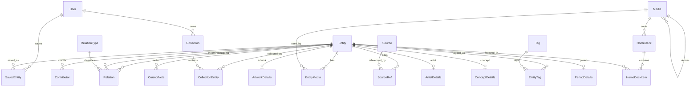

### Entidades clave

| Modelo | Rol |
| --- | --- |
| `Entity` | Nucleo editorial: obra, artista, articulo, concepto, movimiento, periodo, texto o lugar |
| `Relation` / `RelationType` | Grafo semantico entre entidades |
| `Media` / `EntityMedia` | Asset y uso editorial por slot/rol, con crops, focal point, origen y calidad |
| `Source` / `SourceRef` | Trazabilidad bibliografica |
| `Contributor` / `CuratorNote` | Creditos y notas internas |
| `ArtworkDetails`, `ArtistDetails`, `ConceptDetails`, `PeriodDetails` | Extensiones 1:1 por tipo |
| `User`, `SavedEntity`, `Collection`, `CollectionEntity` | Personalizacion y biblioteca de usuario |
| `HomeDeck`, `HomeDeckItem` | Curadoria editorial para superficies de home/recomendados |
| `Tag`, `EntityTag` | Taxonomia editorial |
| `AppSetting` | Configuracion publica de aplicacion |

## Frontend

### Rutas Angular

```mermaid
flowchart TD
  Root["/"] --> HomeComponent
  Recommended["/recommended"] --> RecommendedComponent
  Search["/search"] --> SearchComponent
  Entities["/entities, /entities/:type"] --> EntitiesListComponent
  Entity["/entity/:slug"] --> EntityComponent
  MySpace["/my-space"] --> MySpaceComponent
  Collection["/collections/:id"] --> CollectionDetailComponent
  Profile["/profile"] --> ProfileComponent
  Settings["/settings"] --> SettingsComponent

  Login["/login"] --> LoginComponent
  Blocked["/blocked"] --> BlockedComponent

  Admin["/admin"] --> AdminDashboardComponent
  Admin --> AdminEntitiesComponent
  Admin --> AdminEntityFormComponent
  Admin --> AdminEntitiesDeckComponent
  Admin --> AdminHomeDecksComponent
  Admin --> AdminHomeDeckEditorComponent

  AuthGuard[authGuard] --> Root
  AuthGuard --> Recommended
  AuthGuard --> Search
  AuthGuard --> Entities
  AuthGuard --> Entity
  AuthGuard --> MySpace
  AdminGuard[adminGuard] --> Admin
```

### Inventario de modulos frontend

| Modulo | Responsabilidad | Archivos principales |
| --- | --- | --- |
| App shell | Configuracion Angular, rutas, SSR y layout base | `src/app/app.ts`, `src/app/app.html`, `src/app/app.scss`, `src/app/app.config.ts`, `src/app/app.config.server.ts`, `src/app/app.routes.ts`, `src/app/app.routes.server.ts`, `src/main.ts`, `src/main.server.ts`, `src/server.ts` |
| Core API | Clientes HTTP por dominio y resolucion `/api`/SSR | `src/app/core/api/api-base.ts`, `api-origin.token.ts`, `ssr-api-origin.interceptor.ts`, `entities.api.ts`, `admin-entities.api.ts`, `home-decks.api.ts`, `admin-home-decks.api.ts`, `collections.api.ts`, `saved.api.ts`, `search.api.ts`, `tags.api.ts`, `relation-types.api.ts`, `app-settings.api.ts` |
| Auth frontend | Sesion, JWT en localStorage, guards e interceptor | `src/app/core/auth/auth.service.ts`, `auth.interceptor.ts`, `auth.guard.ts`, `admin.guard.ts`, `guest.guard.ts`, `auth.types.ts` |
| Core UI/SEO | Apariencia y metadatos | `src/app/core/app-appearance.service.ts`, `src/app/core/seo/seo.service.ts`, `src/app/core/search/search-navigation.ts` |
| Shared media | Render editorial de imagenes y resolucion de slots | `src/app/shared/media/jano-media.component.*`, `src/app/shared/media/media.utils.ts` |
| Shared rich text | Contenido enriquecido con previews de entidades | `src/app/shared/rich-text/rich-text.component.*` |
| Shared chrome/decks | Navegacion lateral y deck reutilizable | `src/app/shared/ui/app-chrome/*`, `src/app/shared/ui/entity-deck/*` |
| Home | Superficie editorial inicial | `src/app/features/home/home.component.*` |
| Recommended | Superficie editorial de recomendaciones | `src/app/features/recommended/recommended.component.*` |
| Search | Busqueda por texto/filtros | `src/app/features/search/search.component.*` |
| Entities list | Exploracion/listado por tipo, filtros y taxonomia | `src/app/features/entities/entities-list.component.*`, `_entities-base.scss`, `_entities-explorer-shell.scss` |
| Entity detail | Detalle editorial, guardado, colecciones y grafo embebido | `src/app/features/entity/entity.component.ts`, `entity-detail-view.component.*`, `entity-detail-shell.component.html`, `_entity-*.scss` |
| Graph explorer | Visualizacion avanzada de grafo e imagen con runtime modular | `src/app/features/graph/graph.component.*`, `graph-*.ts`, `image-*.ts` |
| 3D explorer | Exploracion visual con Three.js | `src/app/features/entities-explorer-3d/entities-explorer-3d.component.*` |
| My Space | Guardados y colecciones del usuario | `src/app/features/my-space/my-space.component.*` |
| Collection detail | Detalle de coleccion y grafo asociado | `src/app/features/collection-detail/collection-detail.component.*` |
| Profile/settings | Perfil de usuario y ajustes visuales | `src/app/features/profile/profile.component.*`, `src/app/features/settings/settings.component.*` |
| Auth screens | Login, registro y pantalla beta bloqueada | `src/app/features/auth/login/*`, `src/app/features/auth/register/*`, `src/app/features/auth/blocked/*` |
| Admin dashboard | Entrada profesional de administracion | `src/app/features/admin/admin-dashboard/*` |
| Admin entities | Listado y filtros de entidades admin | `src/app/features/admin/admin-entities/*` |
| Admin entity form | Edicion completa de entidad, media, relaciones, fuentes, contributors y tags | `src/app/features/admin/admin-entity-form/*` |
| Admin home decks | Listado y editor de decks editoriales | `src/app/features/admin/admin-home-decks/*`, `src/app/features/admin/admin-home-deck-editor/*`, `src/app/features/admin/home-decks-editorial-options.ts` |
| Admin visual selector | Seleccion visual de entidades | `src/app/features/admin/admin-entities-deck/*` |
| Estilos globales | Tokens, base, componentes y utilidades | `src/styles.scss`, `src/styles/_tokens.scss`, `_base.scss`, `_components.scss`, `_utilities.scss` |

### Flujo frontend -> API

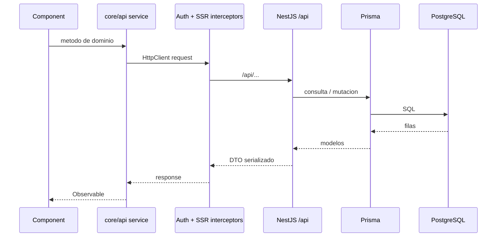

## Sistema de media

El sistema de media ya tiene una separacion valiosa:

- `Media` describe el asset: origen, URL canonica/display, storage key, dimensiones, proveedor, licencia y calidad.
- `EntityMedia` describe el uso editorial: rol, orden, primario, display mode, focal point y crops por slot.
- `media.resolver.ts` en backend resuelve slots para que la fuente de verdad del resultado visual este del lado servidor.
- `shared/media/media.utils.ts` y `jano-media.component` renderizan la decision resuelta en frontend.

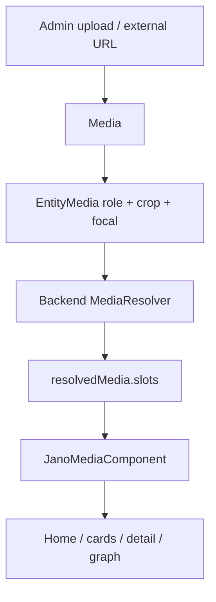

## Autenticacion y permisos

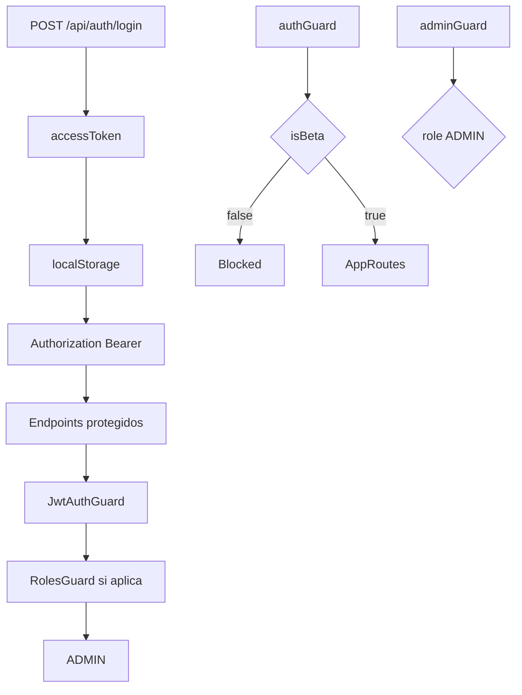

## Infra y ejecucion local

Comandos raiz (`package.json`):

| Comando | Uso |
| --- | --- |
| `npm run setup:local` | Instala backend y frontend |
| `npm run db:up` | Levanta PostgreSQL + Adminer |
| `npm run backend:dev` | Nest en watch mode |
| `npm run frontend:dev` | Angular dev server |
| `npm run prisma:migrate` | Migraciones dev |
| `npm run prisma:seed` | Seed de datos |
| `npm run docker:up` | Stack completo en Docker |
| `npm run docker:down` | Apaga stack Docker |

Servicios Docker:

| Servicio | Puerto por defecto | Rol |
| --- | --- | --- |
| `db` | `5432` | PostgreSQL |
| `backend` | `3000` | API NestJS |
| `frontend` | `4200` | Angular SSR/runtime |
| `adminer` | `8081` | Admin DB |

## Tests existentes

| Area | Tests detectados |
| --- | --- |
| Backend app | `backend/api/src/app.controller.spec.ts`, `backend/api/test/app.e2e-spec.ts` |
| Auth | `backend/api/src/auth/auth.service.spec.ts`, `backend/api/src/auth/strategies/jwt.strategy.spec.ts` |
| Entities | `backend/api/src/entities/entities.service.spec.ts`, `entities.service.media.spec.ts`, `media.resolver.spec.ts` |
| Home decks | `backend/api/src/home-decks/home-decks.service.spec.ts` |
| Frontend app/auth/entities/media | `frontend/src/app/app.spec.ts`, `core/auth/admin.guard.spec.ts`, `features/auth/login/login.component.spec.ts`, `features/entities/entities-list.component.spec.ts`, `shared/media/media.utils.spec.ts` |

## Observaciones tecnicas

1. `EntitiesService` concentra demasiado dominio: listado, home, detalle, grafo, admin CRUD, media, relaciones, fuentes, contributors, tags y preview. Tiene mas de 2300 lineas.
2. `AdminEntityFormComponent` concentra la experiencia admin completa y supera las 3000 lineas. Es el mayor punto de riesgo de mantenimiento en frontend.
3. `GraphComponent` fue parcialmente modularizado en runtimes auxiliares, pero el componente principal aun supera 1200 lineas y coordina demasiadas responsabilidades.
4. Hay uso frecuente de `any` en clientes API, componentes y servicios backend. Esto reduce seguridad de contrato entre Prisma, DTOs y UI.
5. La ruta publica de detalle usa `/entity/:slug`; el modulo `graph` existe como feature independiente pero no tiene ruta propia en `app.routes.ts`. Parece consumido desde detalle, no como pantalla top-level.
6. La validacion global esta bien configurada (`whitelist`, `transform`, `forbidNonWhitelisted`), pero algunos bodies admin inline no usan DTO dedicado, por ejemplo relaciones/tags en `EntitiesController`.
7. El sistema de media esta conceptualmente fuerte: origen, ingesta, promocion, restauracion externa, roles y crops. Conviene protegerlo con contratos tipados y tests de integracion porque es infraestructura editorial central.

## Mejoras recomendadas

### Prioridad alta

| Mejora | Capa | Motivo |
| --- | --- | --- |
| Separar `EntitiesService` en servicios cohesivos | Backend | Reducir riesgo, mejorar testabilidad y preservar backend como fuente de verdad |
| Dividir `AdminEntityFormComponent` por secciones editoriales | Frontend | Mejorar velocidad de cambio y evitar regresiones en admin |
| Crear DTOs dedicados para relaciones y tags admin | Backend | Evitar contratos implicitos con objetos inline |
| Tipar respuestas API compartidas | Frontend/Backend | Reducir `any` y errores silenciosos entre API y UI |
| Añadir pruebas e2e de flujos criticos admin media | Full-stack | Media es infraestructura editorial; los errores afectan WYSIWYG publico |

### Prioridad media

| Mejora | Capa | Motivo |
| --- | --- | --- |
| Extraer facade/store ligero para admin entity form | Frontend | Separar estado, llamadas API y presentacion |
| Consolidar tipos de entidad/media en `core/api` | Frontend | Evitar duplicacion entre public, admin, graph y shared media |
| Formalizar contratos de `resolvedMedia` | Full-stack | Hacer explicita la resolucion de slots y fallback |
| Revisar route strategy de grafo | Frontend/Product | Decidir si el grafo merece ruta propia para sharing y deep links |
| Añadir indices/search ranking explicitos | Backend/DB | Mejorar busqueda y recomendaciones cuando crezca el catalogo |

### Prioridad baja

| Mejora | Capa | Motivo |
| --- | --- | --- |
| Limpiar comentarios temporales tipo "NUEVO"/"Añadir esto" | Codigo | Mejorar tono profesional del repo |
| Documentar convenciones de naming para relation types/tags | Producto/Datos | Evitar taxonomia inconsistente |
| Ampliar `docs/er-diagram.md` con modelos recientes | Docs | Ya existen tags/home decks/media avanzada que deben reflejarse |
| Añadir ADRs para decisiones grandes | Docs/Arquitectura | Conservar contexto de decisiones de media, beta, home decks y SSR |

## Plan de refactor sugerido

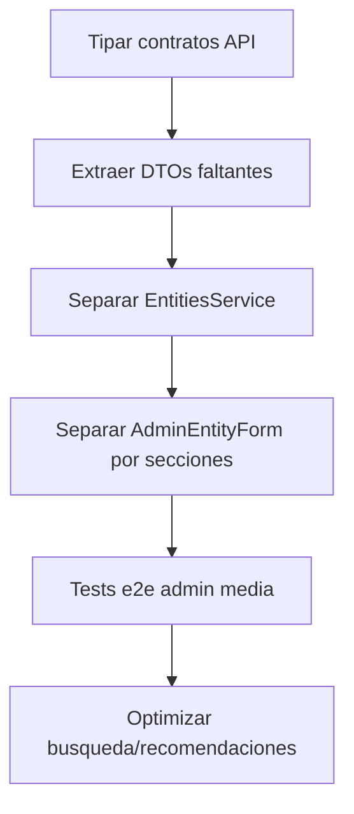

### Separacion backend propuesta

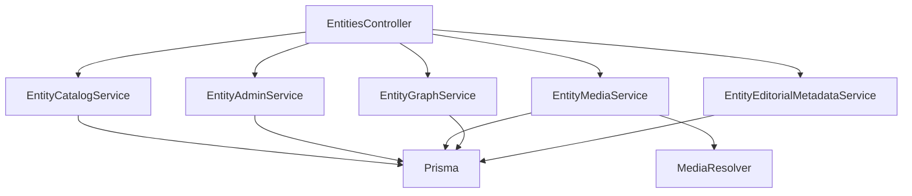

Servicios sugeridos:

- `EntityCatalogService`: `list`, `home`, `getBySlug`, `previewBySlug`.
- `EntityGraphService`: `graphBySlug`, relaciones salientes/entrantes, creacion/borrado de relaciones.
- `EntityMediaService`: media links, upload, ingest, promote, restore, slot resolution.
- `EntityAdminService`: create/update/delete, admin list, admin detail.
- `EntityEditorialMetadataService`: tags, source refs, contributors y detalles tipados.

### Separacion frontend admin propuesta

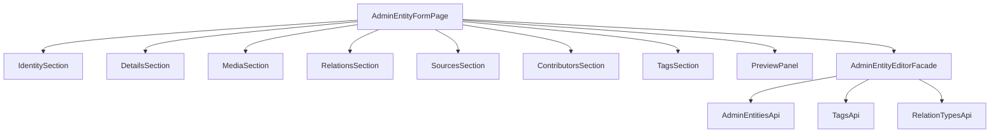

## Lectura de calidad producto

La direccion del repo encaja con la identidad JANO:

- El backend contiene la logica de dominio critica.
- El frontend esta orientado a exploracion visual, detalle editorial y admin profesional.
- El modelo de media ya reconoce slot intent, origen, calidad, crop y fallback.
- El grafo tiene una implementacion ambiciosa, con modulos runtime separados.
- Home decks y recommended soportan curadoria editorial, no solo CRUD.

Los principales riesgos no son de vision, sino de concentracion de complejidad. La prioridad deberia ser modularizar sin cambiar comportamiento, reforzar contratos tipados y ampliar pruebas sobre flujos editoriales.

