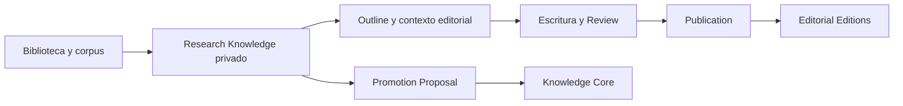

# 00 — Product Vision

## Propósito

JANO es una plataforma premium de descubrimiento cultural, conocimiento conectado y exploración editorial. El Research Studio transforma corpus documental privado en obras editoriales y, mediante revisión explícita, puede aportar conocimiento al Knowledge Core compartido.

## Principios de producto

- El conocimiento se explora; no se trata como una base de datos.
- Las relaciones son objetos editoriales explicables, no líneas decorativas.
- Research es un espacio privado de investigación, no un CMS ni un CRUD.
- Publication es una obra editorial autónoma, no una vista viva de Research.
- Knowledge Core conserva conocimiento canónico; Research nunca lo modifica automáticamente.
- La IA, cuando exista, propone. Las personas deciden.
- La incertidumbre, contradicción y procedencia deben ser visibles y preservables.

La experiencia de investigación se define en [Research Studio: experiencia editorial](./15-research-studio-experience.md). El recorrido de documento a conocimiento revisado se define en el [Editorial Pipeline](./16-editorial-pipeline.md). Este documento conserva sólo la visión estratégica resumida.

## Flujo rector

## Decisiones descartadas

- Publication automática desde Research.
- Promoción automática al Knowledge Core.
- Un segundo Knowledge Core privado.
- Ediciones entendidas como traducciones sincronizadas.
- Un grafo sin semántica, evidencia ni procedencia.

## Extensiones permitidas

Colaboración, IA, procesamiento documental, importadores, nuevos formatos y clientes pueden evolucionar sobre estos límites, pero no pueden alterar ownership ni introducir sincronización automática.
