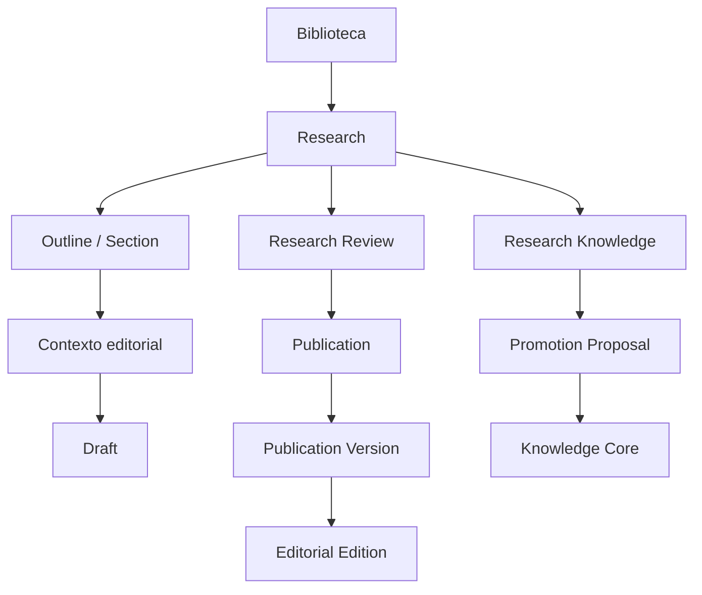

# 01 — Domain Overview

## Propósito

Definir los límites entre corpus, investigación privada, obra editorial y conocimiento canónico.

## Mapa de agregados

## Ownership rector

| Área               | Propietario                                                    | No posee                                  |
| ------------------ | -------------------------------------------------------------- | ----------------------------------------- |
| Biblioteca         | materiales, fuentes y extractos                                | claims, narrativa o conocimiento canónico |
| Research           | investigación, Outline, dossiers, Drafts y Review investigador | Publication, Editions y Core              |
| Research Knowledge | entidades privadas, Claims, evidencia y relaciones privadas    | entidades o relaciones canónicas          |
| Publication        | identidad de obra y sus versiones                              | workspace privado de Research             |
| Editorial Edition  | expresión editorial de una versión                             | Research u otras Editions                 |
| Knowledge Core     | entidades y relaciones canónicas                               | hipótesis y notas privadas                |

## Contradicciones históricas registradas

`editorial-research-studio-adr.md` afirma que Publication establece conocimiento canónico y que Research no duplica Entity, Relation, Source ni Publication. Las decisiones posteriores aprobadas separan explícitamente Publication de Knowledge Core y definen entidades y relaciones privadas de Research. Esta carpeta adopta la decisión posterior: **sólo Promotion Proposal y Knowledge Review pueden modificar el Core**. El documento histórico se conserva sin reescribir.

No se han detectado otras contradicciones bloqueantes en las decisiones aprobadas.
