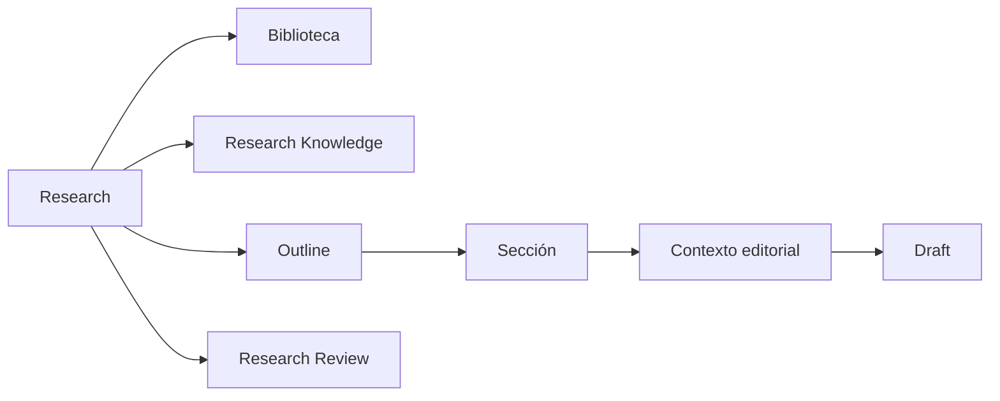

# 02 — Research

## Propósito

Research es el agregado privado que contiene el proceso investigador: propósito, alcance, corpus asociado, conocimiento privado, estructura argumental, dossiers, escritura y decisiones de revisión.

## Responsabilidades

- Delimitar una investigación y conservar su contexto.
- Asociar corpus de Biblioteca sin duplicarlo.
- Poseer Outline, secciones, objetivos, preguntas, notas y Drafts investigadores.
- Poseer Research Knowledge y Research Review.
- Derivar Publications e iniciar Promotion Proposals de forma explícita.

Research se presenta a la investigadora como un flujo editorial continuo, no como una colección de herramientas. La experiencia de ese flujo pertenece a [Research Studio](./15-research-studio-experience.md); la preparación de corpus y propuestas pertenece al [Editorial Pipeline](./16-editorial-pipeline.md).

## Invariantes

- Todo objeto privado tiene un Research propietario.
- Research no modifica el Knowledge Core.
- Research no publica automáticamente.
- Research no depende del Core para existir.
- Archivar preserva el contexto; no equivale a borrado destructivo.
- Un Research con Publications derivadas no se elimina destructivamente.

## Límites

Research puede referenciar materiales, fuentes, extractos, entidades canónicas y recursos visuales. Nunca posee sus copias ni reescribe su ownership.

## Relaciones

## Decisiones descartadas

- Convertir Research en CMS público.
- Hacer que Outline sea el índice público.
- Permitir que notas, dossiers o permisos privados fluyan automáticamente a Publication.
