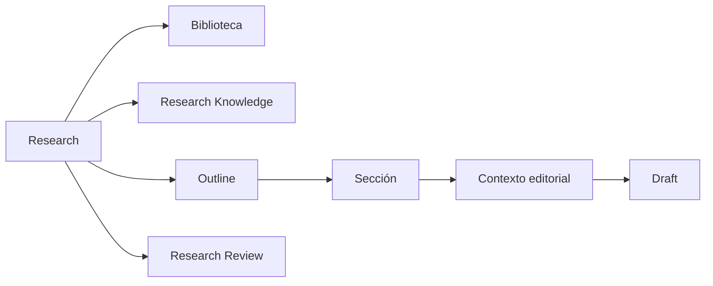

# 02 — Research

## Propósito

Research es el agregado privado que contiene el proceso investigador: propósito, alcance, corpus asociado, conocimiento privado, estructura argumental, dossiers, escritura y decisiones de revisión.

## Responsabilidades

- Delimitar una investigación y conservar su contexto.
- Asociar corpus de Biblioteca sin duplicarlo.
- Poseer Outline, secciones, objetivos, preguntas, notas y Drafts investigadores.
- Poseer Research Knowledge y Research Review.
- Derivar Publications e iniciar Promotion Proposals de forma explícita.

Research se presenta a la investigadora como un flujo editorial continuo, no como una colección de herramientas. La experiencia de ese flujo pertenece a [Research Studio](./15-research-studio-experience.md); la preparación de corpus y propuestas pertenece al [Editorial Pipeline](./16-editorial-pipeline.md).

El contrato de identidad, revisiones, referencias y derivación de un Draft pertenece a [Drafts de Research](./11-research-drafts.md). Research conserva su ownership; este documento evita duplicar esas reglas.

## Section y dossier editorial

Research conserva el trabajo completo y sus objetos privados. En la experiencia diaria, la investigadora trabaja desde una `ResearchOutlineSection`: su objetivo, preguntas, notas, estado, trabajo pendiente y dossier editorial orientan la siguiente decisión útil.

El **dossier editorial de una Section** es una selección contextual y trazable de referencias ya existentes —Sources, Materials, LibraryExcerpt, Evidence, Claims, Entities, Relations o propuestas— necesaria para responder la pregunta de esa Section.

- La Section no posee ni copia corpus o conocimiento.
- El dossier no es una tabla de conocimiento, un writer ni una fuente de verdad adicional.
- Sources, Materials y LibraryExcerpt conservan su ownership en Biblioteca; Evidence, Claims, Entities y Relations lo conservan en Research Knowledge.
- Un mismo objeto puede ser relevante para varias Sections sin duplicarse.
- El dossier organiza el trabajo editorial; no acepta, promociona ni transforma conocimiento.
- La asistencia editorial puede conservar un hilo privado por Section. Cada interacción conserva el
  snapshot del dossier efectivo con el que se generó, incluidas sus referencias documentales; no es
  Knowledge, no modifica Drafts y no sustituye la revisión humana.

### Contrato de selección

El dossier separa contexto propio, anclas editoriales explícitas y soporte derivado:

- Objetivo, preguntas, notas y estado pertenecen a la Section y siempre se muestran; no son referencias del dossier.
- Las anclas editoriales son opcionales y la investigadora las selecciona explícitamente: Source, MaterialVersion, LibraryExcerpt, Evidence, Claim, Entity, Relation o propuesta asistida disponible.
- El dossier efectivo reúne las anclas explícitas y las deduplica; nunca exige que una Section tenga una referencia antes de empezar.
- Procedencia y soporte se reconstruyen desde las anclas: Source y MaterialVersion de un Extracto o una Evidence, Evidence de un Claim, Claims de una Relation y Evidence de una Entity.
- Trabajo pendiente y revisión se derivan del estado de la Section y de los estados de los objetos referidos; no constituyen estados duplicados dentro del dossier.

Cada ancla persistida conserva únicamente la intención editorial de incluir una referencia y su orden. No conserva snapshots, copia de texto, estado de revisión, procedencia duplicada ni resultados derivados. Una referencia puede ser ancla explícita aunque también aparezca como soporte derivado de otra.

Un dossier puede comenzar vacío. La selección de anclas se implementa sólo cuando pueda validar que cada referencia pertenece al mismo Research o, en Biblioteca, que es accesible desde él.

## Invariantes

- Todo objeto privado tiene un Research propietario.
- Research no modifica el Knowledge Core.
- Research no publica automáticamente.
- Research no depende del Core para existir.
- Archivar preserva el contexto; no equivale a borrado destructivo.
- Un Research con Publications derivadas no se elimina destructivamente.

## Límites

Research puede referenciar materiales, fuentes, extractos, entidades canónicas y recursos visuales. Nunca posee sus copias ni reescribe su ownership.

## Relaciones

## Decisiones descartadas

- Convertir Research en CMS público.
- Hacer que Outline sea el índice público.
- Permitir que notas, dossiers o permisos privados fluyan automáticamente a Publication.
