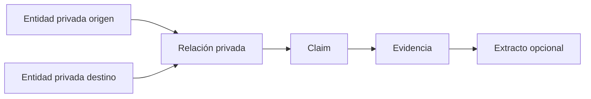

# 04 — Research Knowledge

## Propósito

Research Knowledge es conocimiento privado, situado y revisable dentro de un Research. Permite formular afirmaciones, conservar contradicciones y organizar conexiones sin contaminar el Knowledge Core.

## Objetos

| Objeto           | Definición                                                                                     |
| ---------------- | ---------------------------------------------------------------------------------------------- |
| Entidad privada  | Referente relevante identificado dentro de un Research; no es una entidad canónica incompleta. |
| Claim            | Afirmación atómica que puede sostenerse, cuestionarse o descartarse.                           |
| Relación privada | Conexión entre entidades privadas, organizada por Claims mediante un predicado semántico.      |
| Evidencia        | Uso argumentativo de un extracto o fuente respecto de un Claim.                                |
| Hipótesis        | Estado de un Claim, no objeto independiente.                                                   |
| Hallazgo         | Etiqueta o estado de un Claim, no objeto independiente.                                        |

## Contrato de ResearchClaim

`ResearchClaim` es una única afirmación privada de un Research, respaldada por una o más Evidence válidas. Describe una lectura investigadora, no una Entity, Relation, verdad canónica ni propuesta de promoción.

- Los Claims pertenecen a un único Research y sus Evidence deben pertenecer al mismo Research.
- Claims incompatibles coexisten: `CONTRADICTED` y `QUESTIONED` conservan el desacuerdo en lugar de eliminarlo.
- `ResearchEntity` y `ResearchRelation` organizan la lectura de Claims, pero no adquieren ownership ni sustituyen la procedencia de Evidence.
- Los vínculos `subjectClaimId` y `objectClaimId` se conservan como estructura histórica de Claims; la procedencia de una `ResearchRelation` vive exclusivamente en sus Claims asociados.
- Los estados `DRAFT`, `SUPPORTED`, `QUESTIONED` y `CONTRADICTED` son editoriales y privados. `SUPPORTED` expresa respaldo documental, no verdad ni preparación para el Core.

La API usa `POST /research/:id/claims/:claimId/status`. La migración transforma `readyForPromotion=true` en `SUPPORTED` y el resto en `DRAFT`, sin alterar Claims, Evidence ni timestamps.

## Contrato definitivo de Evidence

Evidence es un uso argumentativo privado de una fuente o Extracto dentro de un único Research. Conserva el contexto de por qué se invoca un pasaje; no posee, corrige ni duplica el corpus y no garantiza por sí sola la verdad de un Claim.

- `libraryExcerptId`, cuando existe, es la referencia documental verificable y debe pertenecer a un Material asociado al mismo Research.
- `sourceId` conserva la referencia bibliográfica compatible y exige una asociación previa del Research a esa Source.
- `sourceVersion` y `locator` conservan la localización declarada por el investigador.
- `quote` es una cita compatible para Evidence sin Extracto; con Extracto es opcional y no sustituye el texto de Library.
- `context` y `note` pertenecen exclusivamente al uso investigador.

Evidence puede existir sin Extracto cuando el material aún no dispone de un fragmento localizable o la procedencia es bibliográfica. Nunca crea un segundo corpus documental. Las entidades de esta fase son entidades privadas de Research, no entidades potenciales ni objetos pendientes de promoción.

## Contrato de ResearchEntity

`ResearchEntity` es un referente privado y estable de un único Research. Existe por sí misma y puede permanecer privada indefinidamente; no expresa candidatura, promoción ni pendiente de Core.

- La identidad, aliases, resumen, confianza y Evidence pertenecen a Research.
- Cada Evidence enlazada debe pertenecer al mismo Research; las tablas puente compuestas impiden duplicados.
- `canonicalEntityId` es opcional y sólo permite reconocer una Entity existente. La consulta no autoriza crear, actualizar ni transferir ownership al Knowledge Core.
- Las relaciones privadas enlazan exclusivamente `ResearchEntity` del mismo Research.
- `reviewState` mantiene revisión editorial privada transitoria; no representa una decisión de promoción.

La migración de este contrato es un renombrado transaccional de tablas, claves e índices. No reescribe filas: conserva IDs, Evidence, relaciones, timestamps y cualquier referencia canónica ya existente.

La API de Research adopta `/research/:id/entities` y `/research/:id/relations` (incluidas sus rutas de revisión); el cambio es exclusivamente terminológico y el DTO de salida mantiene la misma información privada.

## Contrato de ResearchRelation

`ResearchRelation` organiza una conexión privada entre dos `ResearchEntity` del mismo Research. No es una Relation canónica, no posee Evidence y no afirma una verdad independiente.

- Ambos extremos deben existir y pertenecer al mismo Research; no se permiten auto-relaciones en este contrato.
- Una o más `ResearchClaim` del mismo Research otorgan significado y procedencia a la relación mediante `ResearchRelationClaim`.
- `RelationType` es vocabulario canónico opcional y de sólo lectura; no concede ownership ni permite escribir sobre Relation del Core.
- Una relación puede reunir Claims compatibles o en tensión sin resolverlos artificialmente.

La migración preserva IDs, timestamps, `RelationType` y Evidence heredada: cada conjunto de Evidence directa se convierte en un Claim privado determinista antes de retirar `ResearchRelationEvidence`.

## Proyección de Research Knowledge

`Research Knowledge` es un read model efímero y determinista del estado privado actual del Research. No tiene tabla, repositorio, writer ni migración propios: se reconstruye en cada lectura desde `ResearchEntity`, `ResearchRelation`, `ResearchClaim` y `ResearchEvidence`.

El contrato `GET /research/:id/knowledge` devuelve únicamente datos derivados: `entities`, `relations`, `claims`, `contradictions` y `supportingEvidence`. Cada colección se ordena establemente por identidad y la Evidence de soporte se deduplica por identidad. La respuesta no resuelve contradicciones: expone los Claims con `kind=CONTRADICTION` o `status=CONTRADICTED` junto con el resto de Claims.

La proyección representa conocimiento privado organizado, no una verdad canónica, una nueva fuente de verdad, un estado persistente ni una operación de promoción. Entity, Relation, Claim y Evidence mantienen sus responsabilidades y sus writers; Library sigue siendo exclusivamente la fuente documental.

`ResearchClaim` es la única representación persistente activa de una afirmación privada. `ResearchFinding` queda exclusivamente como compatibilidad histórica: el Contract migra cada fila a un Claim con el mismo ID, Evidence, decisiones y timestamps; no tiene writer, endpoint, DTO público, lectura activa ni participación en la proyección.

## Relación con el Editorial Pipeline

El [Editorial Pipeline](./16-editorial-pipeline.md) prepara documentos y propuestas para revisión. Research Knowledge sólo recibe Evidence revisadas, Claims en estado editorial explícito, Entities privadas identificadas y Relations explicadas por Claims. Un Editorial Job o una ejecución de IA nunca constituyen conocimiento revisado por sí mismos.

## Research Graph

El Research Graph es la experiencia visual de lectura de `Research Knowledge` en la Fase 3. No es un agregado, una fuente adicional de verdad ni un contrato de lectura paralelo: consume exclusivamente `GET /research/:id/knowledge` y sus futuras variaciones internas del mismo read model.

### Representación y trazabilidad

- Un nodo representa exclusivamente una `ResearchEntity` privada. Claim, Evidence, Source, LibraryExcerpt y Entity canónica no son nodos por defecto.
- Una arista representa exclusivamente una `ResearchRelation` entre sus dos `ResearchEntity` privadas. No es una verdad autónoma, no se deriva directamente de Claims y no se inventa desde coincidencias visuales.
- Una arista conduce a uno o más Claims asociados mediante `ResearchRelationClaim`. Los Claims aportan significado y procedencia a la relación; no son extremos de la arista.
- Una `ResearchEntity` puede tener Evidence propia para justificar su identificación privada. Esa Evidence no crea por sí misma un Claim ni una Relation.
- La navegación argumentativa es `ResearchEntity → ResearchRelation → ResearchClaim → ResearchEvidence`. Cuando la Evidence tiene `libraryExcerptId`, continúa hasta `LibraryExcerpt → LibraryMaterialVersion → Source`.
- `libraryExcerptId` es opcional. Si no existe, la navegación termina honestamente en la referencia bibliográfica disponible (`Source`, versión, locator y quote); el Graph no oculta la Evidence, no invalida el Claim y no fabrica un fragmento.
- Fuentes y extractos se muestran como contexto de lectura, no como nodos por defecto.

### Contradicciones

Las contradicciones emergen de Claims coexistentes con `kind=CONTRADICTION` o `status=CONTRADICTED`. No son entidades persistentes, no se resuelven automáticamente y no se agregan por votación, confidence promedio ni una representación de verdadero/falso. El Graph debe conservar el acceso a cada Claim y su Evidence.

### Ownership y límites

- `Research Knowledge Projection` sigue siendo el único read model. El Graph no tiene tabla, repositorio, writer, endpoint propio, DTO propio, snapshot ni proyección persistente.
- No se persisten posiciones, clusters, pesos, rankings, scores ni estado local del Graph. Foco y filtros futuros son estado efímero del frontend.
- La topología se construye sólo con `ResearchEntity` y `ResearchRelation` privadas del mismo Research. Claims y Evidence explican la navegación, pero no crean topología adicional.
- El Graph no consulta Entity canónica para construir la topología, no usa slugs canónicos como identidad, no navega hacia rutas públicas o canónicas y no reutiliza `EntityGraphService` como backend. Un `canonicalEntityId` sólo puede informarse como reconocimiento, sin adquirir ownership ni controlar la navegación.
- El Graph no escribe sobre Research, Library ni Knowledge Core y no participa en promoción alguna.

## Invariantes

- El conocimiento privado pertenece a un único Research.
- Confianza orienta revisión; no equivale a verdad.
- Contradicciones no se eliminan para forzar coherencia.
- Entidad privada y entidad canónica no comparten ownership.
- Promover crea o actualiza conocimiento canónico; no convierte ni borra el objeto privado.

## Extensiones futuras

La detección automática, la extracción y los agentes pueden crear propuestas privadas, pero nunca aceptar Claims ni promover conocimiento.
