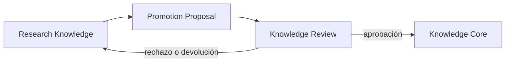

# 06 — Knowledge Core

## Propósito

Knowledge Core conserva entidades y relaciones canónicas, reutilizables y compartidas por JANO. Es independiente de Research y sólo cambia mediante revisión explícita de una Promotion Proposal.

## Promotion Proposal

Una Promotion Proposal transporta una operación canónica explícita desde Research Knowledge hacia Knowledge Review.

Puede proponer crear, vincular, fusionar, actualizar o retirar una entidad o relación canónica. Debe incluir procedencia, razonamiento, evidencia, contradicciones, autor y decisión.

## Invariantes

- No existe promoción automática desde Research ni Publication.
- Toda modificación canónica es explícita, atribuible y trazable.
- Aprobar no modifica ni transforma los objetos privados de origen.
- Rechazar no destruye conocimiento privado.
- El Core no depende de un Research privado para existir.
- Las relaciones canónicas conservan semántica, evidencia y decisión de validación.

## Límites

El Core no almacena notas privadas, dossiers, hipótesis sin revisión ni Drafts. Puede conservar procedencia suficiente hacia una promoción y su evidencia, pero no una copia del workspace privado.
