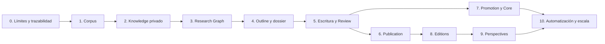

# 08 — Implementation Roadmap

## Estrategia

La implementación se entrega mediante vertical slices completas. No se construye primero una capa técnica y después una interfaz. Cada fase debe dejar un flujo útil, verificable y basado en los contratos anteriores.

Estado de consolidación: las fases 0 (límites y trazabilidad), 1 (Library), 2 (Research Knowledge) y 3 (Research Graph) están completadas. El alcance funcional de la siguiente evolución documental y editorial se define en el [Editorial Pipeline](./16-editorial-pipeline.md); este documento conserva únicamente la secuencia de entrega.

| Fase | Resultado operativo                                 | Contratos protegidos                       |
| ---- | --------------------------------------------------- | ------------------------------------------ |
| 0    | privacidad, ownership, autoría y archivado          | límites de agregado                        |
| 1    | corpus privado con fuentes y extractos verificables | Research → Biblioteca                      |
| 2    | Claims, evidencia, entidades y relaciones privadas  | Biblioteca → Knowledge                     |
| 3    | exploración conectada trazable                      | Knowledge → Graph                          |
| 4    | secciones y dossier editorial                       | Research → Section                         |
| 5    | escritura investigadora incremental y Review        | Section → Draft → Review                   |
| 6    | Publication y versiones inmutables                  | Research → Publication                     |
| 7    | promoción explícita al Core                         | Knowledge → Proposal → Core                |
| 8    | Editions autónomas                                  | Publication Version → Edition              |
| 9    | perspectivas derivadas                              | Publication / Edition → proyecciones       |
| 10   | IA, colaboración y escala                           | contratos existentes sin nuevos ownerships |

## Simplificaciones autorizadas

Comenzar con permisos simples, historial lineal, revisión humana, procesamiento manual, subgrafos limitados, una edición creada manualmente y sin IA. No simplificar ownership, trazabilidad, privacidad, inmutabilidad publicada ni promoción explícita.

La fase 5 se entrega en este orden: identidad y primera revisión de Draft; escritura situada en una Section; referencias editoriales selectivas; revisión de revisiones; incorporación explícita a Publication. La Review de conocimiento ya operativa no sustituye estas piezas de escritura.
