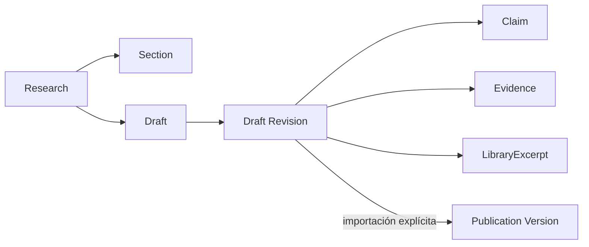

# 11 — Drafts de Research

Estado: **NORMATIVA**

## Propósito

Un Draft es la narrativa privada y provisional con la que una investigadora articula conocimiento investigado dentro de una Section. Convierte un trabajo de lectura, evidencia y revisión en prosa propia sin transformar corpus en narrativa automática ni conocimiento privado en Publication.

No es un resumen del dossier, una copia de Research Knowledge, una Publication incompleta ni un editor genérico de bloques. Su responsabilidad es sostener el acto editorial de escribir: formular, matizar, contrastar y conservar el acceso al soporte que la investigadora ha elegido invocar.

## Ownership y responsabilidades

Research es el único propietario de un Draft, sus revisiones y sus referencias editoriales. Un Draft pertenece a un único Research y se sitúa obligatoriamente en una única `ResearchOutlineSection` del mismo Research.

- La Section aporta objetivo, preguntas, notas y dossier como contexto de escritura; no posee el contenido del Draft.
- Library conserva Materials, Sources, versiones y LibraryExcerpt; un Draft sólo puede referenciarlos.
- Research Knowledge conserva Evidence, Claims, Entities y Relations; un Draft sólo puede invocarlos editorialmente.
- Publication conserva una composición editorial autónoma; nunca posee ni consume un Draft mutable.
- Knowledge Core no recibe Drafts ni los utiliza como soporte de promoción.

Una Section puede tener varios Drafts cuando expresen intenciones narrativas distintas. La experiencia cotidiana debe presentar un único Draft activo por defecto, pero esa conveniencia de interfaz no convierte la singularidad en un invariante de dominio.

## Modelo conceptual



`Draft` conserva identidad, contexto, ciclo de vida y una copia de trabajo mutable autoguardada. `DraftRevision` conserva una representación inmutable del contenido autoral y de sus referencias editoriales. La revisión actual es una decisión explícita de Research; no es un objeto de Knowledge ni una versión de Publication.

El contenido inicial es una narrativa continua con estructura editorial mínima. Un modelo de bloques sólo será pertinente cuando una necesidad medida de comentarios granulares, colaboración o composición lo requiera; no debe anticiparse mediante un sistema genérico.

## Referencias editoriales

Una referencia editorial de Draft expresa que una porción de narrativa invoca deliberadamente un objeto existente como soporte, contraste o cita. Es selectiva, trazable y pertenece a una `DraftRevision`.

Las referencias permitidas son explícitas y tipadas:

- `ResearchClaim`, para adoptar, matizar o cuestionar una afirmación;
- `ResearchEvidence`, para explicar un uso argumentativo concreto;
- `LibraryExcerpt`, para citar o volver al pasaje documental.

Cada referencia debe pertenecer al mismo Research que el Draft; un Extracto debe ser accesible desde ese Research. La referencia puede conservar su rango o posición editorial dentro de la revisión cuando el formato del contenido lo permita.

No existe una referencia genérica reutilizable para todos los objetos del sistema. Entities y Relations pueden aparecer como contexto derivado de Claims, pero no son referencias de escritura necesarias en este contrato inicial. Un Draft tampoco hereda automáticamente todas las referencias de su dossier.

## Contenido, copia y derivación

El Draft posee sólo contenido autoral: texto, estructura narrativa mínima, título o intención editorial y sus revisiones. Una cita incluida conscientemente por la investigadora forma parte de ese contenido, pero conserva una referencia a su Extracto o Evidence de procedencia cuando exista.

El Draft deriva, en tiempo de lectura, el contexto de Section, dossier, preguntas, estado de Claims, contradicciones, trazabilidad de Evidence y disponibilidad del Extracto. Estos datos no se materializan en el Draft, no se almacenan como snapshots y no modifican la revisión escrita.

Un Draft nunca copia automáticamente texto de un Extracto, locator, versión documental, Source, Evidence, Claim, Entity, Relation, notas, dossier o Graph. Tampoco deduce que una pregunta esté respondida: el modelo actual no declara una relación explícita entre Questions y Claims/Evidence, y escribir texto no debe inventarla.

## Revisiones

Una `DraftRevision` es inmutable y preserva el contenido autoral y el conjunto de referencias editoriales con que fue creado. Las modificaciones generan una nueva revisión lineal del mismo Draft; no alteran revisiones anteriores ni objetos referenciados.

El historial lineal es suficiente para la primera implementación. Ramas, fusiones, comentarios, coautoría concurrente y restauración visual son extensiones futuras sobre revisiones identificables; no cambian el ownership básico.

Una revisión puede seguir mostrando que una referencia actual está cuestionada, contradicha o no disponible. Ese cambio es una lectura dinámica y honesta del Research, no una mutación retrospectiva de la revisión ni una reescritura de conocimiento.

## Ciclo de vida editorial

```text
creación intencional
→ escritura y revisiones
→ contraste editorial
→ conservación, archivo o sustitución
→ importación selectiva opcional a Publication
```

- **Creación:** aparece cuando la investigadora necesita articular narrativa; no exige que todos los Claims estén respaldados.
- **Escritura y revisiones:** la copia de trabajo se autoguarda; la investigadora crea una revisión cuando decide fijar un hito editorial.
- **Contraste:** puede volver a Evidence, Extractos, preguntas y contradicciones sin abandonar el contexto de la Section.
- **Archivo o sustitución:** conserva historia privada y no borra procedencia.
- **Derivación:** una DraftRevision o un fragmento identificable puede importarse explícitamente a una PublicationVersion no publicada.

Un Draft no desaparece al derivarse. La Publication conserva su propia composición y una versión publicada permanece inmutable.

## Relación con Publication

La única transición hacia Publication es explícita, selectiva y unidireccional. Publication importa una `DraftRevision` o un fragmento identificable de ella, registra la procedencia de la incorporación y crea contenido propio dentro de una `PublicationVersion` no publicada.

No hay sincronización viva, actualización bidireccional ni dependencia operativa de Publication respecto a Research. Los cambios posteriores en Draft, Library o Research Knowledge no alteran la composición ya importada; una nueva incorporación es una decisión editorial separada.

## Relación futura con IA y colaboración

La IA puede proponer texto, estructura o referencias para una DraftRevision concreta y con procedencia contextual visible. Nunca modifica una revisión silenciosamente, acepta Claims, resuelve contradicciones, publica ni promueve conocimiento. La aceptación humana crea una nueva revisión atribuible.

Comentarios, menciones, revisión por pares y coautoría deben anclarse a una revisión identificable y, cuando exista soporte de rango, a una porción estable de su contenido. Ninguna colaboración concede ownership sobre Library, Research Knowledge o Publication.

## Invariantes

- Todo Draft y toda DraftRevision pertenecen a un único Research.
- El `sectionId` de un Draft pertenece al mismo Research.
- Una referencia editorial no puede cruzar Research ni duplicarse dentro de la misma revisión y destino.
- Una revisión nunca cambia tras crearse.
- Un Draft no posee ni modifica corpus, conocimiento privado, Knowledge Core o Publication.
- El dossier, el Graph, los estados de Claims y la trazabilidad documental se derivan; nunca se copian como snapshot de Draft.
- Importar a Publication es explícito, trazable y no sincronizado; una versión publicada no cambia.
- Ninguna salida automática o de IA crea una revisión aceptada sin una decisión humana atribuible.

## Restricciones explícitas

- No introducir un sistema genérico de referencias.
- No modelar Question → Claim o Question → Evidence por inferencia desde un Draft.
- No utilizar Draft como caché de Research Knowledge o de la Section.
- No convertir el texto de Draft en Evidence, Claim o conocimiento canónico.
- No construir colaboración, bloques, exportación o escritura asistida antes de que una revisión narrativa y sus referencias selectivas estén verificadas.

## Decisiones descartadas

- Un único documento continuo por Research como unidad primaria: pierde el contexto cotidiano de la Section.
- Un Draft por Question: las preguntas no son propietarias de conocimiento y fragmenta artificialmente la escritura.
- Un dossier convertido automáticamente en texto: duplica conocimiento y oculta autoría.
- Un editor genérico de bloques desde el inicio: adelanta complejidad sin necesidad editorial demostrada.
- Una Publication como vista viva de Draft: rompe autonomía e inmutabilidad editorial.

## Referencias normativas

- [Research](./02-research.md)
- [Biblioteca](./03-library.md)
- [Research Knowledge](./04-research-knowledge.md)
- [Publication](./05-publication.md)
- [Contratos](./07-contracts.md)
- [Roadmap](./08-implementation-roadmap.md)
- [Research Studio: experiencia editorial](./15-research-studio-experience.md)
